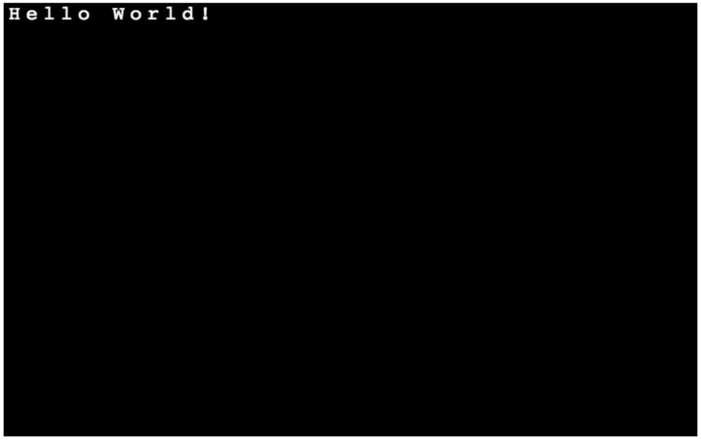

# Tutorial 1 (Hello, World!)
## Introduction

Welcome to rl.js! This library provides an interface for developing roguelikes (and other tile-based games) inside of a canvas element in a modern browser.

To start, we'll review the basic structure of a simple rl.js webpage. Once we've got our static page content in place (and there won't be very much of that), we'll build a canonical "Hello, World!" example.

## Want to skip all this and just see the source?

[Don't worry, it's all on GitHub.](https://github.com/scotchfield/rl.js/tree/master/tutorial/tutorial-1)

## Step One: Static HTML

To start, let's create a very simple webpage.

    <!doctype html><html><body>
    </body></html>

Right away, we create an empty page template with no content.

Next, let's add a link to rl.js. For this tutorial, I'm going to assume that it's located in the same directory as the html file that we're editing.

    <!doctype html><html><body>
    
    </body></html>

So far, so good. Next, we need to start getting some things on the screen.

rl.js uses a canvas element to render content. However, as a game developer, you don't necessarily need to concern yourself with the canvas; you should spend time thinking about the game, while allowing the library to handle the canvas.

Create an empty div element in your new html file, and give it an id attribute. rl.js will create a new canvas, and will append it to the element you specify. For this example, let's call it game_canvas.

    <!doctype html><html><body>
    

    
    </body></html>

And that's the skeleton HTML we need to get started with rl.js. From here, we can focus on the JavaScript.

## Step Two: Adding some JavaScript

For this tutorial, let's write the code inside of our HTML page. In the next tutorial, we'll add a link to the code in the same way that we link to rl.js.

First, add an empty script block.

    <!doctype html><html><body>
    

    
    
    </body></html>

To initialize our canvas, rl.js provides a function called create. It requires a single argument, described above as the id of the element used to append our new canvas. Since we've called our empty div element game_canvas, we can use that. Our code changes as follows:

    <!doctype html><html><body>
    

    
    
    </body></html>

Reload the page, and you'll see a giant rectangle has appeared at the top of the page. That's our empty canvas. The create function accepts a second argument containing a list of options for specifying width, colour, and others. If this argument is not provided, rl.js uses a set of defaults. We'll look at the options in later tutorials. For now, let's just draw some text on the canvas.

To complete the "Hello, World!" example, we'll need to write some text on the screen. rl.js provides a function called write that accepts a string, and a pair of coordinates representing the x and y tile indices to place the text. Remember that instead of using pixels, we'll focus on considering the canvas as a collection of tiles. Each character in the string will be drawn using one of these tiles.

    <!doctype html><html><body>
    

    
    
    </body></html>

Most of the commands in rl.js can be chained together, so we could have written the code like this:

    <!doctype html><html><body>
    

    
    
    </body></html>

Depending on your preference, you may choose to write code in this way.

## Conclusion

That's the basic outline of a simple rl.js app! With one line of JavaScript, we can initialize a canvas element with a default set of parameters. With another, we can write text to the screen.

In the next tutorial, we'll start building something that looks like a real game.