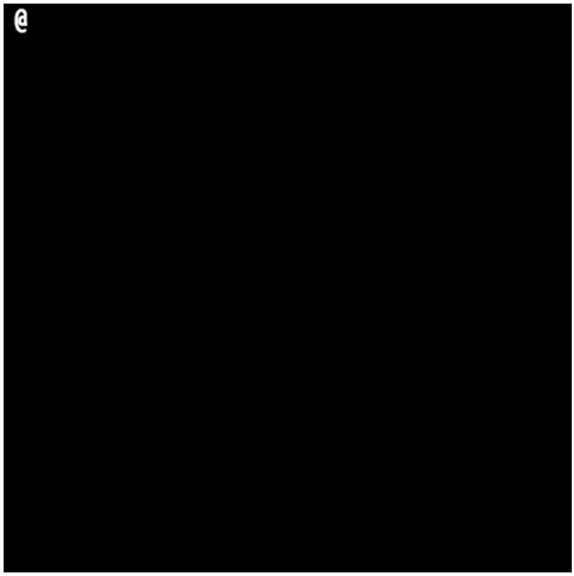
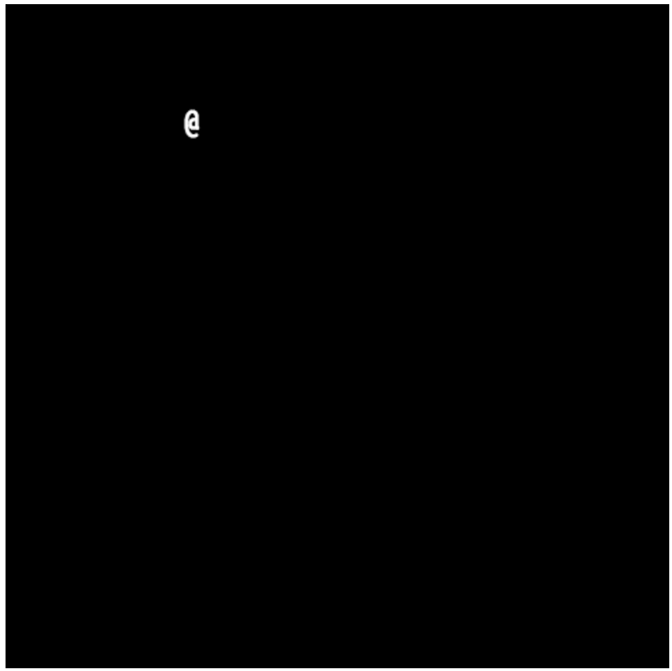

# Tutorial 3 (Basic Movement)
## Introduction

Now that we've got text on the screen along with some basic events, let's get the prototypical roguelike at-symbol moving around the screen in response to a keypress.

## Want to skip all this and just see the source?

[Don't worry, it's all on GitHub.](https://github.com/scotchfield/rl.js/tree/master/tutorial/tutorial-3)

## Step One: Showing The Player

We'll start with the template we've been working with, and set up a closure to make sure we're working in a protected space.

    <!doctype html>
    <html><body>
    

    
    
    </body></html>

Roguelikes have a long tradition of representing the player with an at-sign (@). For this example, we'll do the same. On a plain black background, we'll render the player in white at a particular x and y position on the screen. We can store this information by creating a player object using the JavaScript object literal notation.

    <!doctype html>
    <html><body>
    

    
    
    </body></html>

Each property of the player object corresponds to some aspect of the player's screen presence. The x and y properties (player.x and player.y) represent where the player is in on the screen. The c property represents the character drawn at the player's location, and as mentioned earlier, we'll stick to the canonical at-sign. The style property is a CSS colour value, which in this case is white.

Now that we have this information available, let's define a render function that clears the screen, sets the appropriate style, and draws the player character to the canvas. Once we have the function, we'll call it once (render's gotta render, after all!).

    <!doctype html>
    <html><body>
    

    
    
    </body></html>

## Step Two: Keydown Events

So far, we have a player represented by an object, an appropriately-sized canvas, and an at-sign drawn at the correct location. However, we're not able to do anything with it! The player is lodged there at (0, 0) with no way to navigate around the screen.

rl.js listens for keydown events, and provides a callback mechanism for your own custom handlers. Let's create a keydown handler now.

A standard way to listen for keyboard events in a browser environment is to write a piece of code like this:

    window.addEventListener('keydown', myKeyboardHandler);

The window object, provided by the browser, is informed that on any 'keydown' event (typically occurring when a key is pressed on a keyboard), the myKeyboardHandler function should be called, and the event should be passed as an argument. For example, if I press the 'a' button, somewhere down the line, the myKeyboardHandler function will be called with an argument that represents the 'a' key.

In rl.js, there is a shortcut method called registerKeydown. We can use it in a similar way.

    <!doctype html>
    <html><body>
    

    
    
    </body></html>

With this code, a 'keydown' string will be logged to the console each time a key is pressed.

Instead of logging a static string to the console, we could easily pass the e argument to see what information is actually present. (In fact, feel free to give it a try!) As a shortcut, we'd like to ignore all of the extra information in the event that we don't care about, and instead to only use the information that we do want.

Let's set up a standard WASD movement scheme for our roguelike prototype. When the player clicks W, we'd like to move up. S should move the player down, while A and D will move left and right.

rl.js provides two additional shortcuts to make keyboard handlers easier to write. First, there is a collection of objects that can be used to match keydown events with standard user actions. For example, an object called rl.key.a exists that specifies what an event looks like when the player presses the 'a' key on their keyboard. Second, there is a function called rl.isKey that uses these objects and compares them to an event. If the event matches the object, rl.isKey returns true. Otherwise, the function returns false.

    rl.isKey(e, rl.key.a)

The final thing that we need to remember is that after we update the player position, we need to call our render function once more to draw the player to the screen at the new location. (Good thing we wrote it as a function earlier!)

With these shortcuts, we can write the following code:

    <!doctype html>
    <html><body>
    

    
    
    </body></html>

Perfecto!

Well, almost.

If you hold down one of the keys, or just patiently keep moving toward the edge of the screen, your at-sign will gladly stroll off into obscurity. Let's prevent the player from walking off the edge.

JavaScript has a nifty operator called the ternary operator. We can use it to set the player.x and player.y properties to valid positions in the event that the player has tried to walk off the screen. It works as follows:

    condition_to_test ? value_if_true : value_if_false

So we can write some code like this:

    var x = true ? 42 : 99;

And in the previous example, the variable x will take on the value 42 because the condition evaluates to true. We could have written false in the first position, like this:

    var x = false ? 42 : 99;

In that case, x would take on the value 99.

The ternary operator makes it easy for us to perform checks on the player position and to bring them back to a place they belong.

    <!doctype html>
    <html><body>
    

    
    
    </body></html>

In the event that we try to walk off the edge of the screen, the keydown handler detects that the player is at an invalid position, and resets the x or y coordinate to the farthest acceptable one.

## Conclusion

We've got some movement! In the next tutorials, we'll cover placement of other objects in the game world, and we'll start to explore tiles instead of characters so our world looks a little nicer.