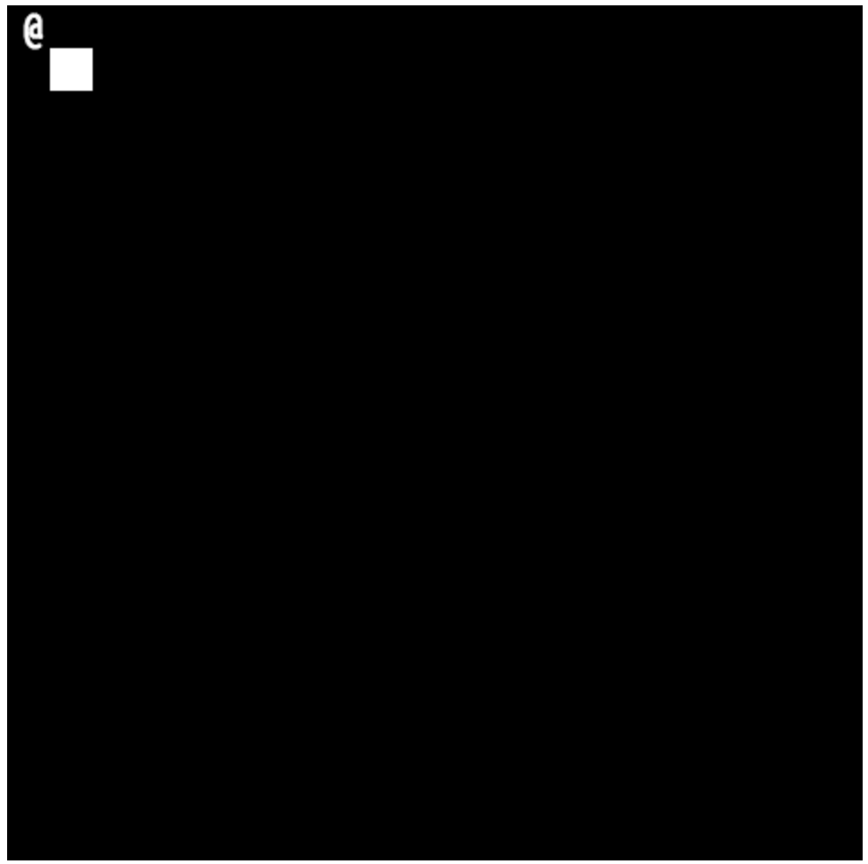

# Tutorial 4 (Walls and Objects)
## Introduction

Our player can move around the canvas in response to keydown events. Now, let's add some walls and objects to the world to interact with. We'll collide with walls, preventing us from moving past them, and we'll add some terrain and other features that can be walked over.

## Want to skip all this and just see the source?

[Don't worry, it's all on GitHub.](https://github.com/scotchfield/rl.js/tree/master/tutorial/tutorial-4)

## Step One: Player Movement

Let's set up a closure with the things we've already learned from past examples to get moving around the screen, with the exception of the code that stops us from walking past the width and height of the canvas.

    <!doctype html>
    <html><body>
    

    
    
    </body></html>

Groovy. Time for some walls.

## Step Two: Blocking Tiles

rl.js has a collection of objects used to implement tiles. The library maintains an internal array of these tiles, and displays them to the screen using its own render function. To add a single tile to our game, we need to make two changes.

First, we'll call rl.addTile after creating our canvas and setting up the keydown callback.

rl.addTile takes two or three arguments. The first two arguments provided are the x and y coordinates of the tile in the world (not on the screen; we've been treating the upper-left corner of the screen as 0, 0 by default, and we'll address that in a second). The third argument is the tile object, which contains information about what the tile will look like, how it should be rendered, and so on. We'll see some examples of that in a second as well. For now, it's enough to note that if we omit the third argument, we get a regular white blocking tile by default.

Change the rl.create block to this:

    rl.create('game_canvas', {width: width, height: height})
        .registerKeydown(keydown)
        .addTile(1, 1);

When the game starts, it will add a single white blocking tile to its list. If you run the game, however, you won't see anything. What gives?

rl.js has its own rendering function, called rl.render, which is responsible for drawing tiles to the screen. rl.render takes two arguments as input: the x and y coordinates of the top-left corner of the screen. Since we've been using 0, 0 so far, we can stick with that for now.

Change the render function to this:

    render = function () {
        rl.clear()
            .render(0, 0)
            .style(player.style)
            .write(player.c, player.x, player.y);
    },

Okay! Looks good.

There's a problem though. If you try to walk into it, the wall doesn't block you. What's the big deal? This is supposed to be a blocking wall, right?

In our movement function, we're not checking to see if the space is free before we change the player x and y coordinates. Let's do that before we move the player into a bogus spot.

First, let's add some temporary variables to store the new x and y position that the player would like to move to.

    keydown = function (e) {
      	var nx = player.x, ny =	player.y;

        if (rl.isKey(e, rl.key.d)) {
            nx += 1;
        } else if (rl.isKey(e, rl.key.a)) {
            nx -= 1;
        } else if (rl.isKey(e, rl.key.s)) {
            ny += 1;
        } else if (rl.isKey(e, rl.key.w)) {
            ny -= 1;
        }

        render();
    };

After that, we'll use rl.canMoveTo to scan the list of tiles stored in rl.js. If any blocking tiles exist at the x and y coordinates passed to rl.canMoveTo, the function will return false.

    keydown = function (e) {
      	var nx = player.x, ny =	player.y;

        if (rl.isKey(e, rl.key.d)) {
            nx += 1;
        } else if (rl.isKey(e, rl.key.a)) {
            nx -= 1;
        } else if (rl.isKey(e, rl.key.s)) {
            ny += 1;
        } else if (rl.isKey(e, rl.key.w)) {
            ny -= 1;
        }

        if (rl.canMoveTo(nx, ny)) {
            player.x = nx;
            player.y = ny;
        }

        render();
    };

If we try to walk through the wall, we're stopped. Hurrah!

## Step Three: Non-blocking Tiles

