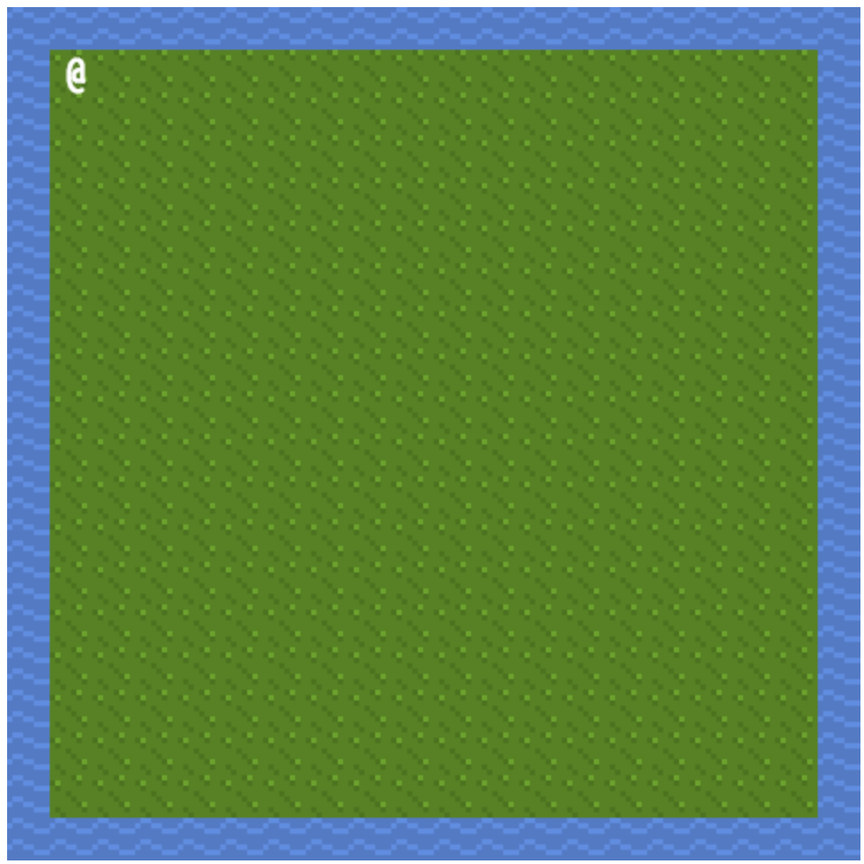

# Tutorial 5 (Image Tiles)
## Introduction

Roguelikes have a long tradition of representing the character using an at-sign. This convention stems from the limitations of the computers used at the time; text consoles limited what could be shown on the screen. With the canvas, we can do more.

In this example, we'll use rl.js to asynchronously load an image, and to define tiles for drawing on the screen instead of text characters.

## Want to skip all this and just see the source?

[Don't worry, it's all on GitHub.](https://github.com/scotchfield/rl.js/tree/master/tutorial/tutorial-5)

## Step One: Basic Outline

Let's use the finished output from tutorial 4 to show how tiles work. We'll assume that we want to do exactly what we did in the last example--a ring of blocking tiles around a non-blocking interior--but that we want to do it with images as tiles. Flat squares are fine and all, but let's jazz it up a touch.

Here's the code from tutorial 4:

    <!doctype html>
    <html><body>
    

    
    
    </body></html>

Recall that this code starts the player at position 1, 1. Blocking tiles (rl.TileBlocking) are placed around the edge of the canvas using the width and height variables we define at the start. Inner tiles are non-blocking (rl.TileNonBlocking), allowing the player to walk around freely.

Let's change those squares to images.

## Step Two: Loading an Image

We'll use a collection of commercial tiles from a talented creator called Oryx. You can find his work at [Oryx Design Lab](http://oryxdesignlab.com/).

Let's use a subset of twelve tiles, each eight pixels wide and eight pixels high. The image we'll use is here:

I've saved this as oryx-tiles.png. Now, to add this to our code, there's one other piece of information we'll need to be aware of.

Since we're running this demo in realtime inside of a browser window, loading an image will happen asynchronously. That means that loading an image happens in two steps: the request to load the image is made, and a callback occurs when the image is actually available. JavaScript doesn't treat the loading as a blocking operation. This isn't a problem because we can pass in a callback, just like we did for the keydown events. Let's use render. (Makes sense, as we'll want to render the tiles to the screen once we have the image available!)

Change the create and register block to look like this:

        rl.create('game_canvas', {width: width, height: height})
            .registerKeydown(keydown)
            .loadImage('oryx-tiles.png', 'oryx', render);

rl.loadImage takes three arguments as input. First, the filename to load. In this case, the input filename is the six-by-two block of tiles mentioned above. The second argument is an identifier that we can use to reference the image in later rl.js library calls. If we want to store tiles in multiple files, we can load several files asynchronously, and reference them by id. The third argument is the callback, which is called once the image has been loaded successfully.

Assuming that the file is loaded successfully, our game has access to the tiles. Let's make one small change to the code and get them on the screen.

## Step Three: Adding Image Tiles

In the last tutorial, we called rl.addTile to add blocking and non-blocking tiles. We were able to specify a colour for the square rendered to the screen by using rl.TileNonBlocking's single argument. Fortunately, to add image-based tiles, the code is similar.

rl.js provides a function to return image tiles with the blocking property called rl.TileImg, which accepts a single object argument containing a set of information about the tile to render. And just like the standard blocking tiles, there's a corresponding non-blocking image tile function called rl.TileImgNoBlock.

Modify the setup function so that it looks like this:

    setup = function () {
        var i, j;

        for (i = 0; i < width; i += 1) {
            for (j = 0; j < height; j += 1) {
                if (i === 0 || i === width - 1 || j === 0 || j === height - 1) {
                    rl.addTile(i, j, rl.TileImg(
                        {id: 'oryx', x: 16, y: 0, w: 8, h: 8}));
                } else {
                    rl.addTile(i, j, rl.TileImgNoBlock(
                        {id: 'oryx', x: 8, y: 0, w: 8, h: 8}));
                }
            }
        }
    },
    
The only thing we've changed is the third argument in each rl.addTile function call. In each case, we've passed an object with five parameters. Those parameters are:

* id: The image id provided to rl.loadImage
* x: The x-coordinate (in pixels) of the tile to use in the input image
* y: The y-coordinate (in pixels) of the tile to use in the input image
* w: The width of the tile (in pixels) in the input image
* h: The height of the tile (in pixels) in the input image

Here's the original image again:

You might need to look closely at the screen, but the tiles are each eight-by-eight pixels in size. The tile used for rl.TileImg in the example is 16 pixels in on the x-axis, and 8 in on the y-axis. It's a water tile, and it'll block the player. The tile used for rl.TileImgNoBlock is a green grass tile, and it won't block the player.

So with that asynchronous loadImage function call and the two small modifications to addTile, we can run the code to get the following:

## Conclusion

Hey, things are actually starting to look pretty nice! (Thanks, Oryx! And reader, go buy some tilesets!)

Now, with image-based tiles, movement, and other elements in place, we can start to build some more complicated examples.
