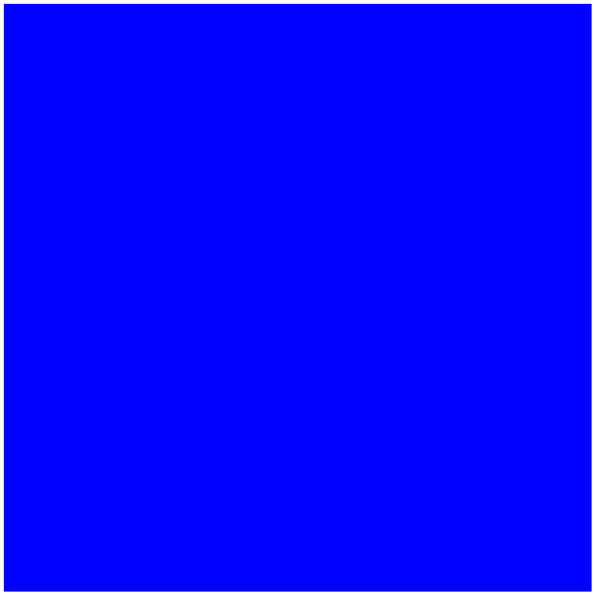
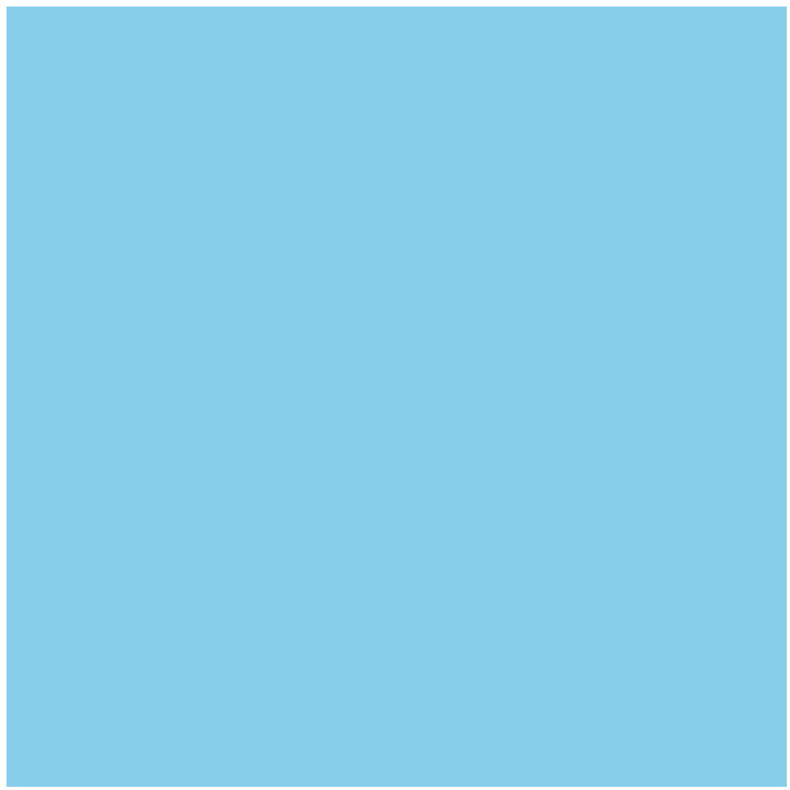
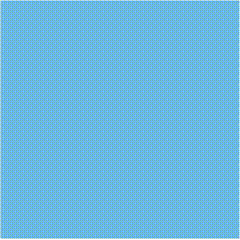

# Tutorial 6 (Custom Tiles)
## Introduction

Using image tiles provides a really nice way of providing some basic information about the player's world. We can define blocking tiles, like the water in the previous example, and non-blocking tiles, like the grassy terrain that a player should be able to stroll across with no issue.

In this tutorial, we'll look at extending the basic tiles to produce custom tiles. These might be items in the game that a player could pick up, switches or toggles that can modify the world, or simply tiles that exhibit visual effects that change over time. We'll look at the latter in this example, and built up more complicated examples in a future tutorial.

Let's fill the canvas with water tiles that use a timer to interpolate between two colour values.

## Want to skip all this and just see the source?

[Don't worry, it's all on GitHub.](https://github.com/scotchfield/rl.js/tree/master/tutorial/tutorial-6)

## Step One: Basic Outline

We'll start simple.

    <!doctype html>
    <html><body>
    

    
    
      </body>
    </html>

Remember that we're wrapping everything in a closure to keep our data protected from the global space. Otherwise, it's just a basic 20-by-20 canvas with nothing in it.

## Step Two: Custom Tiles

In rl.js, tiles are represented by functions. A function, in JavaScript, is a first-order object, which means we can treat tiles as objects with keys and values. Since functions have code blocks that can be called, we can return new tiles and pass them to rl.addTile.

Let's add the following code to the top of our closure:

    var WaterTile = function () {
    };

Okay, it's not doing anything right now. However, this is the start of something neat. It's going to be a tile!

JavaScript isn't an object-oriented language, so we won't be subclassing rl.TileBlocking or rl.TileNonBlocking. We can use a different functional approach that creates a new object of the type that we want to extend, modifies it appropriately, and returns the new one.

Let's make a basic WaterTile that just uses rl.TileBlocking in this way. In addition, let's add a WaterTile to each position on the screen, and call rl.render() to draw everything for us.

    var width = 20, height = 20,

    WaterTile = function () {
        var that = rl.TileBlocking();

        that.style = function () { return 'rgb(0, 0, 255)'; };

        return that;
    };

    rl.create('game_canvas', {width: width, height: height});

    for (var i = 0; i < width; i += 1) {
        for (var j = 0; j < height; j += 1) {
            rl.addTile(i, j, WaterTile());
        }
    }

    rl.render();

Hello, first custom tile! Okay, it's a little harsh on the eyes, so let's change that solid blue to something a little more palatable.

    WaterTile = function () {
        var that = rl.TileBlocking();

        that.style = function () { return 'rgb(135, 206, 235)'; };

        return that;
    };

That's a little softer. (Actually, it's sky blue, but we'll pretend it's water for now).

So what happened there? How did we use a custom tile to change what we see on the screen?

rl.js expects every tile object to have a style property, implemented as a callable function. The return value of the tile's style function is passed to rl.style. In our WaterTile, we always return a static string; this value is used to set the style.

rl.js also expects every tile object to have a render property, implemented as a callable function. However, we don't need to specify this function because we're extending rl.TileBlocking, which has its own render function (draw a square at the specified position). By extending the base tile and modifying the properties that we want to change, we can create new tiles that act in custom ways.

Custom tile, yay!

## Step Three: Animating the Tiles

We can take this a step further and use the fact that style is a function. Let's animate the tile by setting up some code that interpolates between two colour values. For example, if we have two nice shades of blue, our code will smoothly change the colour value at a tile from one to the next.

This code can be implemented by adding two values to the tile's constructor. The start parameter will represent a time value at which to start our animation, and the interval parameter will represent how long the interpolation between colour values will take.

Our style function will need to know a few pieces of information: the two colours to interpolate between (we'll call them a and b in the new style function), and our position in the animation for the current tile (we'll store that in a local variable called t).

Bear with me. We'll explain the style function in some detail. First, let's get the code in place.

Here's the new WaterTile:

    WaterTile = function (start, interval) {
        var that = rl.TileBlocking();

        that.start = start;
        that.interval = interval;

        that.style = function () {
            var a = [0, 71, 171], b = [135, 206, 235],
            t = ((Date.now() - this.start) % this.interval) / this.interval;

            t = (Math.sin(t * 2 * Math.PI) + 1) / 2;

            return 'rgb(' +
                Math.round(a[0] + (b[0] - a[0]) * t) + ',' +
                Math.round(a[1] + (b[1] - a[1]) * t) + ',' +
                Math.round(a[2] + (b[2] - a[2]) * t) + ')';
        };

        return that;
    };

So what's happening in that style function now? Well, since it's a function, we can do some additional processing to create a dynamic style string.

As mentioned above, the variables a and b store the two colour values we want to interpolate between. You can see our friend sky blue there on variable b. Variable a is cobalt. That sounds more water-like. Yeah, let's go with that.

The t variable uses the current time, derived from Date.now(), along with the interval value, to calculate the current time into the animation. For example, if we created the tile one second earlier, and our interval is two seconds, we can calculate that we're half way between the animation.

The second assignment to t uses a sine wave so that our interpolation is nice and smooth--the colour value ramps toward a or b, slows down a little bit, hits the target, then accelerates toward the other colour value. Repeat until shutdown.

Finally, the large return statement at the end ensures that all of the rgb values are rounded. The variable t takes on a value from 0 to 1, and since there's an implicit assumption that values in b are larger than the ones in a, we can just take the colour value in a and add t * b to it, for each of the colour values.

This is where a textbook would say "Fix the code so that values in b can be smaller than the ones in a," or "this is an exercise left to the reader." Really, I should just fix that. Sorry! But I hope the point is clear.

To get this animating, we'll need to update our call to rl.addTile and add a timer to call rl.render periodically.

Update the variable list:

    var width = 20, height = 20, timer,

And the rl.addTile call:

    for (var i = 0; i < width; i += 1) {
        for (var j = 0; j < height; j += 1) {
            rl.addTile(i, j, WaterTile(Date.now(), 1000));
        }
    }

Finally, assign to timer.

    timer = setInterval(function () {
        rl.render();
    }, 50);

Cool, it's animating!

You know what stinks though? All the tiles have the same start time and interval length. Let's throw some random values in there to make things more dynamic.

    for (var i = 0; i < width; i += 1) {
        for (var j = 0; j < height; j += 1) {
            rl.addTile(i, j, WaterTile(
                Date.now() + Math.random() * 4000,
                Math.round(2000 + Math.random() * 2000)));
        }
    }

Neato.

## Conclusion

In this example, we built a custom tile, and provided a new style function overriding the default one from rl.TileBlocking.

In the next example, we'll create some more custom tiles, and show how a player can interact with the environment using this approach.
