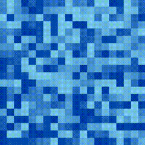

# Tutorial 6 (Custom Tiles)
## Introduction

Introduction

## Want to skip all this and just see the source?

[Don't worry, it's all on GitHub.](https://github.com/scotchfield/rl.js/tree/master/tutorial/tutorial-6)

## Step One: Basic Outline

Step One.

## Conclusion

Conclusion.
